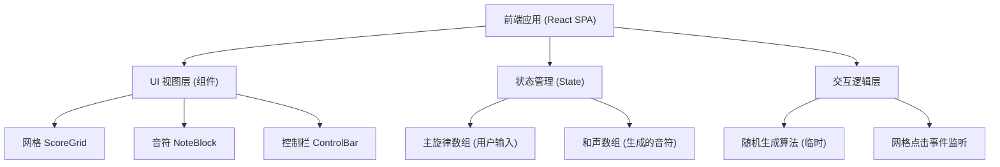

## 1. 架构设计



## 2. 技术栈说明
- **前端框架**: `React@18`
- **构建工具**: `Vite`
- **样式与设计**: `tailwindcss@3` + `lucide-react` (图标)
- **状态管理**: React 原生 Hooks (`useState`, `useCallback`, `useMemo`)
- **动画库**: `framer-motion` (实现音符跳动、生成动画) 或者原生 CSS transition

## 3. 路由定义 (目前为单页)
| 路由 | 用途 |
|-------|---------|
| `/` | 应用主页，展示乐谱编辑器 |

## 4. 核心数据结构定义

```typescript
// 表示单个音符的数据结构
type Note = {
  id: string;      // 唯一标识
  pitch: number;   // 音高 (行坐标)
  step: number;    // 时间步/节拍 (列坐标)
  voice: 'user' | 'alto' | 'tenor' | 'bass'; // 属于哪个声部
};

// 整个乐谱的状态
type ScoreState = {
  notes: Note[];
  isPlaying: boolean;
};
```

## 5. 核心逻辑：随机和声生成算法 (Mock)
当前作为占位，不连接真实 AI 模型。点击“生成”按钮时：
1. 遍历当前乐谱的时间步（共 4 个小节，每小节 4 拍，总计 16 步）。
2. 对于每个时间步，检查用户是否输入了音符。
3. 如果输入了，则在当前步的其他音高位置，随机生成 3 个不同音高的音符，分别赋值给 `'alto'`, `'tenor'`, `'bass'`。
4. 为生成的音符分配稍后的显示时间（通过设置动画 delay 模拟真实生成过程）。

## 6. 后续接入 AI 模型的扩展接口
为之后接入 `Magenta.js` (Coconet) 预留的数据接口：
- `harmonize(userNotes: Note[]): Promise<Note[]>`
- 将用户的 `Note[]` 转换为 `NoteSequence` 格式供 AI 推理。
