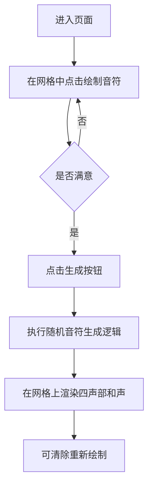

## 1. 产品概述
复刻 Google Bach Doodle 网页版的交互界面，包含交互式五线谱/钢琴卷帘 UI。
- 主要目的是实现用户在网格上点击放置音符的功能，并提供一个“运算”按钮。点击按钮后，系统会模拟 AI 模型的行为，在空白处随机生成其他声部的和声（配器）。目前不包含真实的 AI 推理模型，重点在于跑通界面交互和视觉反馈。
- 该界面的核心价值在于为后续接入真实的 AI 音乐生成模型（如 Coconet）提供一个高可用、美观的前端壳子。

## 2. 核心功能模块

### 2.1 角色定义
| 角色 | 注册方式 | 核心权限 |
|------|---------------------|------------------|
| 普通访客 | 无需注册 | 自由绘制旋律、点击生成随机和声并预览 |

### 2.2 功能模块
1. **乐谱网格区 (Score Grid)**: 纵向代表音高 (Pitch)，横向代表时间 (Beats/Steps)。**乐谱固定为 4 个小节 (Measures)，若每小节 4 拍，则横向共 16 步 (Steps)**。用户可以点击空白处添加音符，点击已有音符删除。
2. **控制栏 (Control Bar)**: 包含“生成和声 (Harmonize)”、“清除 (Clear)”等操作按钮。
3. **视觉反馈 (Visual Feedback)**: 用户自己输入的旋律（主旋律）与系统生成的和声（其他三个声部：女低、男高、男低）用不同的颜色进行区分。

### 2.3 页面详情
| 页面名称 | 模块名称 | 功能描述 |
|-----------|-------------|---------------------|
| 主页面 | 顶部标题区 | 显示产品标题与提示信息 |
| 主页面 | 交互乐谱区 | 核心功能，监听点击事件以切换音符的亮灭状态 |
| 主页面 | 操作按钮区 | 触发随机和声生成的算法，并渲染回乐谱区 |

## 3. 核心流程
用户进入页面 -> 在乐谱网格上点击输入主旋律 -> 点击“生成”按钮 -> 系统基于随机算法为每个时间步填充缺少的声部音符 -> 界面以不同颜色高亮显示生成的新音符。

## 4. UI/UX 设计风格
### 4.1 设计风格
- **整体氛围**: 纸质质感、复古、古典与现代科技结合（类似原版 Google Doodle 的感觉）。
- **主色调**: 暖黄色（背景纸张）、深棕色/黑色（网格线与UI边框）。
- **音符颜色 (四声部区分)**:
  - 用户输入（主旋律/女高音 Soprano）：高亮蓝色/紫色。
  - 生成和声1（女低音 Alto）：橙色。
  - 生成和声2（男高音 Tenor）：绿色。
  - 生成和声3（男低音 Bass）：红色。
- **按钮风格**: 圆润的实体按钮，带有轻微的阴影和悬浮反馈，点击有下压动画。
- **字体**: 衬线字体（如 Playfair Display, Merriweather）搭配清晰的无衬线字体。

### 4.2 响应式与交互
- 桌面端优先，大屏下网格更清晰。移动端需要允许横向滚动或者缩放显示。
- 音符添加/移除时需要有轻微的缩放动画（Scale In/Out）。
- 点击“生成”时，可以通过错落的延迟动画（Staggered Animation）让生成的音符依次“蹦”出来，增加趣味性。
